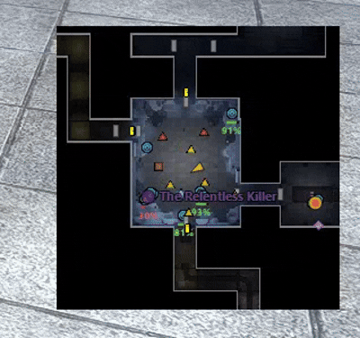

PT-BR / EN - ENGLISH VERSION BELOW
-

LeLeMap - Guia rápido

Instale criando uma pasta chamada 'LeLeMap' dentro da pasta de plugins do Dungeon Helper e colocando estes 3 arquivos dentro dela:

%APPDATA%\Dungeon Helper\plugins\LeLeMap

A versão mínima do Dungeon Helper para este plugin funcionar corretamente é a versão Beta atual disponível em:

https://dungeonhelper.com/beta

---  

**desenhe em seus prórios mapas!**
  quando vc quiser desenhar em um mapa, primeiro salve a imagem dele clicando em 'load map'. depois abra a pasta do plugin, e localize a imagem na pasta 'my maps'. Edite ela como quiser, e renomeie colocando '_edit' no final do nome original. Deixei algumas imagens minhas na pasta 'my maps'

  

**Load Map -** recarrega o mapa atual. Também salva um arquivo de imagem na pasta 'my maps'.  
se quiser usar versões editadas de mapas, salve o arquivo de imagem com "_edit" no final do nome, e o plugin usará essa versão no lugar da original.  
**▶ / ⏸ -** pausa ou retoma a atualização do mapa.  
**Icons + / - -** controla o tamanho dos ícones.   
**Filters ▼ -** filtra quais ícones aparecem e abre opções como HP Bar, Text Size e nomes sempre visíveis.  
**Auto Center -** mantém a câmera seguindo seu personagem.  
**Search / X -** procura por nome no mapa e limpa a busca.  
**Trace Target -** desenha linha até a entidade marcada.  
**Select on Hit -** clicar no ícone tenta selecionar a entidade no jogo.  
**🔔12 -** liga ou desliga o alerta sonoro para quando o grupo de Raid encher.  
**🔲 Overlay -** abre o mapa em modo overlay.  
**Follow / Fit -** no overlay, segue o player ou enquadra o mapa.  
**Transp. Blacks -** remove áreas pretas grandes da imagem do mapa. Deixando ele transparente onde normalmente é um fundo preto.
**🔲 Mini Map -** abre ou fecha a janela separada do mapa.  
**📐 Order -** ajusta a ordem de desenho das categorias/ícones.  

### Mouse e atalhos

**Ctrl+M -** abre ou fecha o Mini Map.  
**Ctrl + Scroll -** controla o zoom.  
**Botão do meio + drag -** move a câmera manualmente.  
**Clique direito no Mini Map -** abre o menu contextual.  
**Hover -** mostra tooltip da entidade/ícone.  
  
---  

## **ENGLISH VERSION**

LeLeMap - quick guide

Install it by creating a folder named 'LeLeMap' inside the Dungeon Helper plugins folder and placing these 3 files inside it:

%APPDATA%\Dungeon Helper\plugins\LeLeMap

The minimum Dungeon Helper version required for this plugin to work correctly is the current Beta version available at:

https://dungeonhelper.com/beta

---  

**Draw over your maps!**
  when you want to draw over a map, click 'load map' to save the img of the current map in the 'my maps' folder, in the plugin folder. Then edit the image as you like. Then rename it adding '_edit' to the end of the original name (do not change the original name of the map). i left some examples inside the 'my maps' folder you can use.

  
  
**Load Map -** reloads the current map. It also saves an image file in the 'my maps' folder.  
if you want to use edited map versions, save the image file with "_edit" at the end of the name, and the plugin will use that version instead of the original.   
**▶ / ⏸ -** pauses or resumes map updates.  
**Icons + / - -** controls icon size.   
**Filters ▼ -** filters which icons appear and opens options such as HP Bar, Text Size, and always-visible names.  
**Auto Center -** keeps the camera following your character.  
**Search / X -** searches by name on the map and clears the search.  
**Trace Target -** draws a line to the marked entity.  
**Select on Hit -** clicking an icon tries to select the entity in-game.  
**🔔12 -** turns the sound alert on or off for when the Raid group becomes full.  
**🔲 Overlay -** opens the map in overlay mode.  
**Follow / Fit -** in overlay mode, follows the player or fits the map to the window.  
**Transp. Blacks -** removes large black areas from the map image.  
**🔲 Mini Map -** opens or closes the separate map window.  
**📐 Order -** adjusts the drawing order of categories/icons.  

### **Mouse and shortcuts**

**Ctrl+M -** opens or closes the Mini Map.  
**Ctrl + Scroll -** controls zoom.  
**Middle button + drag -** moves the camera manually.  
**Right-click on the Mini Map -** opens the context menu.  
**Hover -** shows the entity/icon tooltip.  
